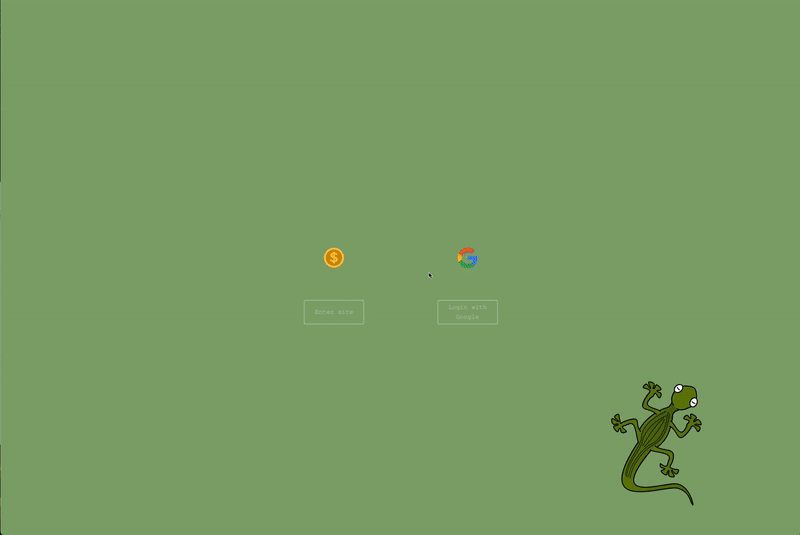

# Welcome to Coin Lizard!
--------------

***By Matt Zamora and Ben Pu***

## Overview
--------------
Coin Lizard is a MERN stack clone of [CoinGecko](https://www.coingecko.com/en) that allows users to view prices, market data and analysis of the top 200 crypto currencies. Coin Lizard utilizes the CoinGecko API to gather relevant data and displays it on a responsive React.js front-end. It leverages Google OAuth for a seamless authentication process which allows users to login/sign-up with their Gmail accounts. Users are also able to add specific cryptos to their watchlist which are then rendered on the user's profile page.

<!--  -->

## Front-End Technologies and Code Snippets
------  
Coin Lizard is a MERN stack app which means that it utilizes JavaScript and React.js on the Front-End. Redux was also implemented in order to manage the application's state. The Coin Gecko API was used in order to gather and display all of the necessary data. This API was extremely well documented and had a ton of endpoints to work with which allowed us to extract prices, weekly changes, descriptions, market caps etc from the return objects. 

To display the relevant information that corresponds to a specific crypto currency, a get request is made to the Coin Gecko API. This is done by setting up a Redux action called fetchData() that takes in an *id* as a parameter. The *id* in this case is the name of the crypto.

```JavaScript
export const fetchData = (id) => async (dispatch) => {
  const res = await coinGeckoClient.coins.fetch(id, {});
  if (res.code === 200) {
    dispatch({ type: coinConstant.FETCH_COIN_DATA, payload: res.data });
  }
};
```

The action is then dispatched on the corresponding crypto's profile page where the returned data is rendered. 
```HTML
<div>
          <h5>Market Cap Rank: {data.market_cap_rank}</h5>
          <h5>Date Created: {data.genesis_date}</h5>
          {data.market_data && (
            <>
              <h5>Total Supply: {data.market_data.total_supply}</h5>
              <h5>Max Supply: {data.market_data.max_supply}</h5>
              <h5>Circulating Supply: {data.market_data.circulating_supply}</h5>
            </>
          )}
</div>
```

On the home page, we wanted users to have the ability to see which cryptos they have already favorited and also give them an option to favorite/unfavorite cryptos. For favoriting/unfavoriting, the handleFavorites() function is called whenever a user clicks on the star icon. If the *isFavorited* prop is *true*, it dispatches the removeFavorite() action which signifies that the user wants to remove the crypto from their watchlist. The back-end then makes a *delete* request and removes that entry from the *Favorites* cluster. If the *isFavorited* prop is *false*, it dispatches the addFavorite() action which signifies that the user wants to add the crypto to their watchlist. The back-end then makes a *post* request and adds that form entry to the *Favorites* cluster.

```JavaScript
const handleFavorites = (e) => {
    const form = {
      coinName: coin.id,
      _user: user._id,
    };

    if (isFavorited === false) {
      dispatch(addFavorite(form));
    } else {
      dispatch(removeFavorite(coin.id, form));
    }
  };
```

In order to display which cryptos a user has already favorited, the isFavorited() function is passed down as a prop from the *Home* component to the *Coin* component. isFavorited() takes in the array of *favorites* from the user's redux store and a *coinId* and returns a boolean whether or not that coinId appears in the user's *favorites* redux store.

```JavaScript
const favorites = useSelector((state) => state.favoriteReducer);

const isFavorited = (array, coin) => {
    for (let i = 0; i < array.length; i++) {
      let obj = array[i];
      if (obj[Object.keys(obj)[1]] === coin.id) {
        return true;
      }
    }
    return false;
  };
```

## Back-End Technologies and Code Snippets
------  
MongoDB, Express and Node.js were used to construct the back-end features. In our Mongo cluster, we set up two collections: one for Users and one for Favorites. The Users cluster stores all the necessary data for authenticated users whereas the Favorites cluster keeps track of which cryptos each user has favorited. As mentioned above, Google OAuth was used for the authentication process. We wanted to streamline the authentication process by allowing users to use their exisiting Gmail accounts for sign-up/login instead of requiring them to create a brand new Coin Lizard account. 

In the code snippet below, this function is ran whenever a user logs-in. `User.findOne({ googleId: profile.id }) ` searches the User cluster for an entry with a matching googleId. If there are no matches, it means this is a new user and a new entry is created. Otherwise, it means the user has already signed up and nothing is done.

```JavaScript
passport.use(
    new GoogleStrategy(
        {
            clientID: keys.googleClientID,
            clientSecret: keys.googleClientSecret,
            callbackURL: '/auth/google/callback'
        },
        (accessToken, refreshToken, profile, done) => {
            const name = profile.name.givenName + ' ' + profile.name.familyName
            User.findOne({ googleId: profile.id }) 
                .then((existingUser) => {
                    if (existingUser) { 
                        done(null, existingUser);
                    } else { 
                        new User({ 
                                    googleId: profile.id, 
                                    name: name
                                })
                            .save() 
                            .then(user => done(null, user));
                    }
                })
        }
    )
);
```

The following two code snippets are the models for the User and Favorite clusters. The User model stores a googleId, which is a unique string that references specific google accounts, and a name string. 

```JavaScript
const userSchema = new Schema({                       
    googleId: String,    
    name: String,
});
```
The Favorite model stores a coinName as a string (bitcoin, ethereum etc) and the id of the user that has favorited that coin. 
```JavaScript
const favoriteSchema = new Schema({               
    coinName: String,
    _user: { type: Schema.Types.ObjectId, ref: 'User' }
});
```


